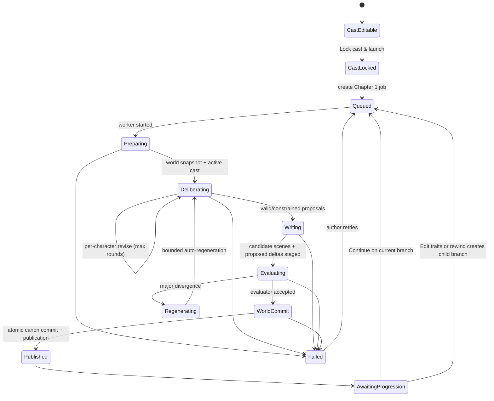

# Story Engine — Technical & UI Design Specification

## 1. System Overview

### Core Intent

Story Engine is a desktop-first, responsive, multi-tenant web application where each author creates private branching, agent-assisted stories. An author supplies a seed, chooses a generated concept, defines and locks a founding cast, and then advances a story chapter by chapter. Each chapter is generated through a visible, bounded discussion between a Director, a world agent, and a storyteller agent. The result is automatically published as canon after validation and may create multiple durable parallel timelines.

The product is text-first in MVP: chapters are structured as scenes and character dialogue. Comic/image generation, export rendering, and media review are deliberately deferred behind stable extension points.

### Target Audience & Core Use Cases

**Primary audience:** an individual author who wants an approachable, visual story-development environment with AI assistance but meaningful control over canon and branching. Multiple authors may use the platform, but every author’s data, stories, agent memory, and personalization profile are isolated.

| Use case | Author outcome |
| --- | --- |
| Seed a new story | Turn an idea, dream fragment, partial narrative, or preset into three editable concepts. |
| Establish a world | Select a concept, define the founding cast, and lock their identities before the story begins. |
| Advance the narrative | Choose a proposed direction or submit a free-text action; watch the agent discussion; receive a new published chapter. |
| Explore alternatives | Turn multiple choices into preserved parallel branches and switch among timelines. |
| Maintain canon | View a read-only graph of entities, locations, relationships, and current status; create deliberate canon-event requests. |
| Assess quality | Review the evaluator and business reports; inspect agent-run traces when the trace feature flag is enabled. |
| Restart safely | Start a new arc with selected carryover while preserving the archived history of earlier arcs. |

### Architectural Principles

- **World agent is the canonical writer.** Entity status/location, relationships, canon facts, reveal state, and direct canon-event outcomes can only be committed by the world-agent command path.
- **World-write authority is enforced in code and database access, not by prompt text.** Only the world-command service role can execute canonical-state transactions; all other agents receive read-only data and return proposals.
- **Deliberation is visible, but safe.** The interface streams concise, sanitized progress cards and decision summaries—not hidden prompts, secrets, or full private chain-of-thought.
- **One Director coordinates many characters; the storyteller writes prose.** A single Director agent per active story branch proposes each active character’s intent/actions/dialogue through isolated character-specific calls; the storyteller turns valid proposals into screenplay scenes.
- **Character memory and Director memory are separate.** Every character owns independent canon/experience memory. The single branch Director owns separate private coordination memory. Character memories are never merged or persisted into Director memory, and Director memory can never write canon directly.
- **Generation is bounded and recoverable.** Director/world discussion loops per character for at most the configurable discussion-round limit (default 2). Every job is idempotent, observable, resumable, and retryable.
- **Published chapters are immutable canon.** A generation is staged, evaluated, then atomically committed and published by the world-agent command path. Revisions create a new generation/revision record or branch; they never silently alter published history.
- **Branches are first-class.** Choice outcomes are parallel continuations. Each branch inherits an immutable world-state snapshot at its fork and can never mutate another branch’s state.
- **Canon is branch-scoped after a fork.** “Canon” means the immutable history and current state of the active branch. Story-wide identity records are shared, but state, facts, relationships, and events are never shared implicitly across branches.
- **Multi-user platform; one owner per story in MVP.** Each authenticated user owns a private tenant. Each story has one owner; collaboration can be added later without exposing another user’s personal, story, or agent memory.
- **Personalization is explicit and private.** User preferences are collected with consent, are editable/deletable by the user, and are injected only into that user’s generation context. They are not story canon, are not shared between users, and are never silently copied into character or Director memory.
- **Accessible by default.** Color never carries status alone. Semantic labels, icons, text states, keyboard navigation, focus visibility, reduced motion, contrast-safe tokens, and configurable typography are product requirements.

### Reference Architecture

| Layer | MVP choice | Responsibilities |
| --- | --- | --- |
| Web client | Next.js + React + TypeScript + Tailwind CSS, built as static assets | Responsive application shell, streamed UI, accessible components. |
| Application/API | Python FastAPI in Databricks Apps | Serves static web assets, REST/SSE endpoints, auth boundary, validation, and generation submission. |
| Authentication | Databricks Apps identity/OAuth + secure session cookies | Establishes the tenant/owner identity; protects REST and SSE requests with the same authorization policy. |
| Async workers | Python wheel tasks in Databricks Jobs + Lakebase-backed durable job queue | Agent fan-out, retries, evaluator/business reports, memory compaction, and future exports. |
| Transactional database | Lakebase Postgres | Story/canon data, branches, reports, agent-run audit trail, outbox events, and queue leasing. |
| Lakehouse data | Unity Catalog + Delta tables/Volumes | Governed append-only operational audit export, analytics, model-evaluation datasets, and durable files. |
| Realtime transport | Server-Sent Events (SSE) for MVP | Ordered one-way job events to the active author; reconnect using `Last-Event-ID`. WebSocket is an optional future upgrade. |
| Deployment | Declarative Automation Bundles + GitHub Actions | Defines and deploys Databricks Apps, Jobs, Lakebase resources, permissions, and environment targets from source control. |
| Observability | Structured logs, traces, metrics, `agent_runs`, Delta audit export | Per-job lifecycle, latency, retry count, model/provider metadata, redacted input/output references. |

### Configurable Product Limits

Default guardrails must be configuration, not hard-coded UI rules:

| Setting | Initial default | Reason |
| --- | ---: | --- |
| Active characters per beat | 4 | Controls fan-out cost and keeps streamed discussion understandable. |
| Director/world discussion rounds | 2 | Bounded generation latency and cost. |
| Recent episodic memories | 15 | Director context budget. |
| Recent screenplay lines | 20 | Voice continuity context budget. |
| Short-input clarification threshold | 12 tokens | Triggers a visible confirmation/clarification loop; it never silently rejects a short creative seed. |
| Seed maximum | 2,000 characters | Protects prompt/context budgets. |
| Generation retry attempts | 3 | Retry transient failures before surfacing recovery UI. |
| Automatic evaluator regenerations | 2 | Prevents an unbounded loop when a candidate has major divergence. |
| Storyteller narrative directions | 2 | Advisory creative directions only; they are not progression modes. |
| Minimum chapters before manual ending request | 3 | Prevents premature ending requests while preserving author agency. |
| Automatic ending-readiness score | 0.75 | Default pacing threshold; author may still request endings at the minimum chapter count. |
| Concurrent generation jobs per user | 2 | Bounds tenant cost and queue contention. |
| Chapter generations per user per day | 20 | Explicit, adjustable usage quota. |
| Regressive trait-edit nudge threshold | 3 requests in a rolling 10-chapter window | Triggers a gentle safety nudge and safer alternatives; it does not silently alter traits. |
| Per-user daily model-token budget | 250,000 input + output tokens | Maps to provider-rate spend at runtime; pauses new generation submissions when exceeded. |

## 2. User Flows & Navigation

### Application Navigation

The desktop shell uses the prototype’s persistent 240px sidebar. On tablet and mobile it becomes an accessible drawer opened from the top bar. Navigation reflects story context; unavailable sections show an explanatory disabled state rather than an empty screen.

| Area | Route shape | Availability |
| --- | --- | --- |
| Seed & Input | `/stories/new` | Always |
| Concept Selection | `/stories/:storyId/concepts` | Concepts exist |
| Cast & Characters | `/arcs/:arcId/cast` | A concept has been selected |
| Narrative Workspace | `/arcs/:arcId/branches/:branchId` | Cast is locked and a chapter exists or is generating |
| Progression & Volume | `/arcs/:arcId/timeline` | At least one branch/chapter exists |
| World Sandbox | `/arcs/:arcId/world` | Arc exists |
| New Arc Premise | `/arcs/:arcId/restart` | Restart request in progress |
| AI Agents | `/chapters/:chapterId/reports` | A chapter/report exists |

### Primary User Journey

1. Author starts a story and selects a seed type: custom prompt, dream fragment, partial narrative, or an original/licensed preset from the template library.
2. Author enters the seed, selects one or more genres, selects one tone, chooses an art-style preference (stored now for future media flows), and reviews input. A short or ambiguous seed enters a visible clarification loop: plain-language interpretation, 2–4 suggestions, and free-text correction. The author confirms or redirects before character/concept generation; the UI nudges after three rounds but never silently infers an answer.
3. The utility agent drafts three concepts and an initial relationship graph. The client shows a generation state; success opens Concept Selection.
4. Author selects and may edit a concept. Selecting it creates the initial arc and seed entities.
5. Author edits the founding cast’s name, role, voice, traits, and visual attributes. At cast lock, the agent system derives any hidden characteristics privately from the approved profile; hidden characteristics have no author-facing input or display before reveal.
6. Author presses **Lock cast & launch Chapter 1**. The system atomically locks founding-cast identity fields and immediately enqueues Chapter 1 generation—there is no second Generate action.
7. Workspace opens in a generation state. It first shows a loader, then streams a live, accessible agent-discussion timeline as agent events arrive. When scenes are available they progressively render in the reader.
8. When the candidate passes evaluation, the world agent atomically commits the staged state and automatically publishes the chapter. Business analysis may arrive shortly after publication.
9. After every published chapter, the author sees exactly three next-step modes: **Continue automatically**, **Edit traits**, or **Jump / rewind**. Continue advances the focal character with no edits; Edit traits offers safe suggested and free-text branch-scoped trait-state changes; Jump/rewind selects a prior story scene and creates a child branch. Submission starts the next chapter generation for the resulting active branch.
10. The parent and every generated child branch remain available in the timeline indefinitely. Choices that were not selected remain as choices on the parent until the author selects them; they do not create speculative branches. The author can change active branch without changing any canonical state in another branch.

### Generation State Machine



### Branch Model and Navigation

- A chapter belongs to one `story_branch`; a root branch starts at Chapter 1.
- The root branch is created with the selected concept, but its first authoritative world-state snapshot is written at cast lock after the initial realm and active cast pass validation.
- Selecting **Jump / rewind**, an approved trait-state edit, or a revision creates a child branch. The parent chapter does not become invalid or overwritten. Continue automatically remains on the current branch. Storyteller-proposed narrative directions may inform the next chapter, but they are not additional progression modes.
- Child-branch creation copies the parent’s latest published state snapshot and records the exact parent chapter. It is one transaction, so a child never starts from an ambiguous or later parent state.
- A branch has a stable label (`Main`, `Option A`, author-renamed label) and a status: `ACTIVE`, `PAUSED`, `COMPLETED`, `ARCHIVED`.
- Branch timeline nodes show chapter number/title, publish status, evaluator state, and child-branch count. Status is represented by icon plus text, not color alone.
- The currently viewed branch is the active context for generation, entity graph, reader, reports, and world state.
- Branches are retained forever. The author may archive or hide them from the default timeline view; archival is reversible and does not delete history.

### Streamed Agent Discussion Experience

The workspace has a dedicated **Generation activity** region above the screenplay reader. It is interactive in the sense that it updates live and lets the author inspect approved/rejected proposals, but it does not let the author alter an in-flight generation.

| Event phase | Safe visible content | UI behavior |
| --- | --- | --- |
| Queued | Queued/status | Indeterminate loader and status text. |
| World context | “World agent mapped 3 active characters in Upper Citadel.” | Timeline card; no secret/canon payload dump. |
| Director proposals | Character name, goal summary, proposed action summary, emotional state | Individual cards enter as events stream. Do not expose hidden characteristics or private prompt context. |
| Validation | Approved, adjusted, or needs revision; concise rationale | Proposal card receives labeled status. Rejections create a linked revision event. |
| Storytelling | “Composing scenes and dialogue.” | Skeleton scene cards transition into streamed scene blocks when available. |
| Candidate ready | Number/type of proposed changes | Preview card; the content remains explicitly labelled “Not yet published.” |
| Canon commit | Number/type of committed changes | Success card with a link to affected graph entities. |
| Evaluation | Evaluator status and regeneration status | Banner announces automatic regeneration if a major divergence is found. |
| Completed | Published chapter title and available choices | Reader controls become enabled; live region announces completion. |

Event cards must contain an explicit sequence number, timestamp, agent label, status label, and concise description. The default view is a readable summary. When `agent_trace_enabled` is true, an “Inspect run” drawer can reveal redacted inputs/outputs, duration, retry count, and correlation ID for that event.

### Author Edits and Canon-Event Requests

Generated content is never changed in place after publication.

| Author action | Processing rule |
| --- | --- |
| Edit concept or founding cast before lock | Save directly with normal validation. |
| Edit mutable trait state or relationship | Submit an explicit, visible request; evaluator and world agent validate it; on approval it creates a child branch with a versioned trait/relationship state snapshot. Locked core identity remains unchanged. |
| Edit an unpublished generated draft/revision | Send to evaluator, then world validation if it changes entities, facts, relationships, status, location, reveals, or chapter meaning. |
| Edit published screenplay/dialogue | Open an explicit **Edit as revision** flow. Create a revision request and run evaluator + world validation. On approval, create a replacement child branch from the chapter’s parent state and publish the revision there; retain the original chapter and branch unchanged. |
| Edit presentation-only metadata (title, branch label, local annotation) | Save immediately; no agent evaluation. |
| Request a canon event (kill/revive/move/introduce entity) | Create `canon_event_request`; evaluator assesses compatibility with current branch; world agent makes final validation/commit decision. |
| Hidden-characteristic reveal | No direct author control in MVP. It may only occur when the storyteller agent proposes it and the world agent commits it at an appropriate story moment. |

The evaluator is an advisory validation input for author requests; the world agent remains the final authority for canon writes. A rejected request stays in the audit log with a safe explanation and may be revised/resubmitted.

## 3. UI/UX Architecture & Layout System

### Design Tokens

Use Tailwind tokens backed by CSS custom properties so stories or user preferences can safely configure font families and sizing without changing component logic.

| Token family | Default | Usage |
| --- | --- | --- |
| `color.bg` | `#0B0E1A` | Application canvas |
| `color.surface.elevated` | `#12172A` | Sidebar, elevated containers |
| `color.surface.panel` | `#171D33` | Panels/input background |
| `color.surface.card` | `#1D2440` | Cards |
| `color.border.default` | `#2A3255` | Dividers and boundaries |
| `color.text.primary` | `#EAE6DA` | Primary content |
| `color.text.muted` | `#9AA1C2` | Secondary content |
| `color.text.subtle` | `#616A93` | Metadata |
| `color.accent.amber` | `#E8A33D` | Primary action and context markers |
| `color.accent.violet` | `#8C6BFF` | AI/generation context |
| `color.status.success` | `#4FC3B0` | Approved/in-sync, always paired with icon/text |
| `color.status.danger` | `#D1544A` | Destructive/error, always paired with icon/text |
| Display type | Fraunces, configurable serif fallback | H1, chapter titles, concepts |
| UI type | Inter, configurable sans fallback | Controls, body, data labels |
| Technical type | IBM Plex Mono, configurable monospace fallback | Agent events, IDs, technical metadata |
| Spacing | 4px base scale (`1,2,3,4,5,6,8,10,12`) | All layout and component gaps |
| Radius | 8px controls; 12px cards; 16px dialogs | Consistent shape language |
| Motion | 150ms standard; 220ms panel transition | Respect `prefers-reduced-motion`; never use motion as sole feedback |

Typography must expose a user preference for readable system font, increased text scale, and high-contrast theme. Never encode graph node type or report status by color alone.

### Layout Shell and Responsiveness

| Breakpoint | Shell behavior |
| --- | --- |
| `xl` (≥1280px) | 240px sticky sidebar; main workspace max-width 1240px; workspace uses graph/reader split. |
| `lg` (≥1024px) | Same sidebar; split workspace may use 40/60 proportion. |
| `md` (≥768px) | Collapsible sidebar; two-column screens may remain side-by-side if each panel has ≥320px. |
| `sm` (<768px) | Sidebar becomes modal drawer; top bar contains menu/context/actions; graph and reader become tabs; tables become stacked cards; primary action is full width. |

The narrative workspace uses CSS grid: `minmax(320px, 0.9fr) minmax(420px, 1.1fr)` on desktop. The reader is the visual priority. The graph must never trap keyboard focus or require a pointer for essential story information; entity list alternatives are provided.

### Component Hierarchy

```text
AppShell
├── StorySidebar / MobileNavigationDrawer
├── ContextTopBar
├── ToastRegion + ARIALiveRegion
├── SeedWizard
├── ConceptSelector
│   └── ConceptCard
├── CastSetup
│   └── CharacterCard
├── NarrativeWorkspace
│   ├── GenerationActivityFeed
│   │   └── AgentEventCard / TraceDrawer
│   ├── EntityGraph (read-only) + AccessibleEntityList
│   ├── EntityInspector
│   ├── ScreenplayReader
│   │   └── SceneBlock / DialogueBlock
│   └── BranchDecisionComposer
├── TimelineExplorer
├── WorldSandbox
│   ├── RosterTable
│   └── CanonEventRequestDialog
├── AgentReports
│   ├── EvaluatorReportCard
│   └── BusinessReportCard
└── AsyncState components
    ├── LoadingState
    ├── EmptyState
    ├── ErrorState
    └── RetryPanel
```

### Interaction and Accessibility Rules

- Use native buttons, fields, labels, tables, dialogs, and semantic headings before custom ARIA.
- All controls must be operable by keyboard; focus ring uses a 2px violet outline at minimum.
- Generation activity is `aria-live="polite"`; critical failed/completed events are `assertive` only when necessary to avoid excessive announcements.
- The stream auto-scrolls only while the author is at the newest event. Otherwise show a **Jump to latest (N)** control.
- Destructive or high-impact canon-event requests require an explanatory confirmation dialog with target, branch, consequence, and “This creates a permanent canon-event record” copy.
- Loading uses both progress/status text and a nonessential visual indicator.
- Graph relationships are duplicated as a keyboard-readable relationship list and entity details panel.

## 4. Screen-by-Screen Specifications

### Screen: Story Seeding

**Purpose:** capture enough creative context to create concepts without overwhelming a new author.

**Layout blueprint:**

```text
Seed & Input
Plant the first spark                         [Step 1 ● ○ ○ ○]

Question content
  1. Seed-type cards
  2. Prompt textarea + count
  3. Genre multi-select + Tone single-select
  4. Review + art-style preference

[Back]                                              [Next / Generate concepts]
```

**Components & interactions:** four-step wizard; auto-advance after seed type; short-input clarification instead of a hard minimum; multi-select genre; single-select tone; review step; original/licensed template-library picker for preset mode. Sponsored or editorially curated templates/suggestions show a persistent text disclosure such as **Presented by [Brand]** or **Featured selection**, with an equal-access link to the full library and no narrative insertion. The clarification card reflects the interpretation, offers 2–4 suggestions, allows free-text correction, and requires a visible continue/confirm action. Art-style preference is persisted but has no text-MVP dependency.

**States:** default; clarification required; clarification redirecting; inline field validation; generating concepts (button disabled + status); resumable network error; no concepts generated yet; saved draft restoration after refresh.

### Screen: Concept Selection

**Purpose:** let the author choose one generated direction before creating an arc.

**Layout blueprint:** three equal concept cards on wide screens, stacked on narrow screens; sticky action row with **Regenerate concepts** and **Continue to cast setup**.

**Components & interactions:** selectable cards, inline title/summary/core-conflict editing, initial-entity chips, initial relationship/family-tree summary, regeneration confirmation if edits would be replaced. The selected concept is visually marked with text and icon.

**States:** concepts loading; selected; editing; regeneration in progress; regeneration failure retaining existing concepts; empty generation response with retry and return-to-seed action.

### Screen: Cast & Characters

**Purpose:** define the founding cast and establish immutable identity baselines.

**Layout blueprint:** responsive card grid; each card includes name, role, voice/dialogue style, traits, and visual attributes. A bottom action row has Back and **Lock cast & launch Chapter 1**.

**Components & interactions:** add/remove founding character; required name/role; autosave draft; lock confirmation summarizes number of characters and irreversibility of identity fields. On confirmation, `cast_locked` is committed and Chapter 1 is queued immediately.

**Hidden characteristic rule:** hidden characteristics are derived/stored only in agent-visible context at cast lock. They have no author-facing field. Do not show a blur, “secret exists” badge, or hint in roster, graph, reader, API payload, trace summary, or reports until a story reveal has been committed. This explicitly supersedes and removes the older genre-gated blurred-hint behavior in `story-engine-backend-design-final.md` and the prototype Cast-screen hidden row; genres must not re-enable it.

**States:** editable; autosaving; field errors; locking; lock failure with retry; locked transition to narrative workspace; empty cast prevented from launch.

### Screen: Narrative Workspace

**Purpose:** make story state legible while the author reads a chapter, watches agents deliberate, and branches the story.

**Layout blueprint:**

```text
Story / Branch / Chapter context                [Sync] [Interest] [Reports]
──────────────────────────────────────────────────────────────────────────
Generation Activity (only while active; collapsible after completion)
 [1 World] → [2 Kaelen proposal] → [3 Validation] → [4 Storyteller] ...
──────────────────────────────────────────────────────────────────────────
Read-only World State                    Chapter Reader
 [filter] [entity graph]                 Chapter title / published status
 Accessible entity list                  Scene → action → dialogue
 Entity inspector                        ...
                                       Branching decision
                                       ( ) Choice A
                                       ( ) Choice B
                                       ( ) Custom action __________
                                                    [Create parallel branch]
```

**Components & micro-interactions:**

- Context top bar: story, branch, chapter status, evaluator status, and business score. Clicking reports opens the relevant report screen.
- Generation Activity: receives SSE events, uses ordered timeline cards, supports expand/collapse and trace inspection behind a feature flag; streamed screenplay blocks use subtle fade-in unless reduced motion is active.
- Entity Graph: read-only pan/zoom/fit controls may be included. Selecting a node opens entity inspector. Relationship changes are requested through a clear world/canon-event flow rather than direct graph manipulation. A list view provides equivalent data.
- Screenplay Reader: structured sluglines, action, dialogue character, parentheticals, and lines. It renders partial candidate content safely while streaming with a visible **Generating—unpublished preview** label; it replaces/discards rejected candidate content on regeneration and marks content published only after completion. Published chapters expose **Edit as revision**.
- Progression composer: author first selects the focal character, then chooses exactly one mode: Continue automatically, Edit traits, or Jump/rewind. Trait editing offers suggested safe edits, free text, and Go with the flow; Jump/rewind uses prior published scenes and creates a child branch. The action label describes whether it will continue the current branch or create a parallel branch.

**States:** no chapter yet/queued; loading before first stream event; streaming; partial scene; evaluation/regenerating; published; ending-options available; evaluator-blocked after retry exhaustion; pending reports; agent failure with Retry; disconnected/reconnecting SSE; empty graph; branch-selection disabled during active generation.

### Screen: Progression & Volume Manager

**Purpose:** browse durable branches and chapter history; retain a future home for exports.

**Layout blueprint:** timeline explorer first, then branch details and an export/volume card. In text MVP, comic/export controls are visibly marked “Coming later” rather than appearing operable.

**Components & interactions:** expandable tree/timeline, branch switch, archive/unarchive, chapter metadata, evaluator badges, and a reader link. Archive requires confirmation but has no destructive behavior.

**States:** initial chapter only; multiple branches; archived branches hidden/shown; empty export state; timeline-load failure.

### Screen: World Control Sandbox

**Purpose:** inspect current branch world state and request explicit canon events.

**Layout blueprint:** roster/state table, current-realm summary, and canonical action section. On small screens roster rows become character cards.

**Components & interactions:**

- Founding cast after lock: identity fields read-only; requests can affect status/location only when approved.
- Introduced characters: author can edit profile, subject to evaluator/world validation when changes affect active canon.
- Canon-event dialog supports kill, revive, move realm, relationship request, and introduce character; includes rationale and branch target. Introducing a character presents world-agent-suggested relationships to the existing roster for author confirmation before evaluation.
- Submit creates a pending request. Evaluator checks compatibility; world agent accepts, adjusts, or rejects; accepted events enter the canonical audit log and update graph/roster.
- Restart arc opens the New Arc Premise flow and never wipes prior chapters.

**States:** data loading; no entities; request draft; evaluating; accepted/adjusted/rejected; world-write conflict; network error; archived branch read-only.

### Screen: New Arc Premise

**Purpose:** launch a safe new arc from archived history with selective carryover.

**Components & interactions:** choose retained entities/relationships/realm, request three premise options, edit selected premise and objectives, confirm launch. Confirmation creates a new arc and `arc_carryover` records; source arc becomes archived only if the author chooses that action.

**States:** drafting options; editable; launch queued; failure/retry; no eligible carryover with a clear reset option.

### Screen: AI Agents & Reports

**Purpose:** surface consistency and narrative-interest assessments without granting reports canon-write authority.

**Components & interactions:** evaluator summary, character and world-fact checks, business score/breakdown/notes, report timestamp/version, re-run action, and optional trace link. Re-run creates a new report version; it does not alter chapter content.

**Critical behavior:** a `MAJOR_DIVERGENCE` blocks automatic publication. The orchestrator automatically regenerates within the configured retry budget. If exhaustion occurs, show the generation as blocked with a readable evaluator explanation, retry action, and branch-preserving failure record.

**States:** pending during candidate evaluation; in sync; minor divergence; major divergence/regenerating; blocked; published report available; stale re-run report; report API failure.

### Screen: Ending Options

**Purpose:** let the author choose a deliberate ending instead of silently auto-resolving a branch.

**Components & interactions:** the business/story evaluator marks a branch as `ENDING_ELIGIBLE` when `0.30 × chapter-progress + 0.35 × business pacing-closure score + 0.20 × Director open-thread resolution + 0.15 × evaluator consistency score ≥ ending-readiness threshold`; each input is normalized to 0–1 and persisted in the report. The author may also request ending options after the configured minimum chapter count. The storyteller proposes multiple distinct endings. Selecting an ending creates/continues the appropriate branch and follows the normal candidate/evaluator/publication workflow.

**States:** not yet eligible; eligible; generating options; options ready; manual request unavailable before threshold; error/retry; ending published; branch remains open for alternate endings.

## 5. Data Model & State Management

### Key Entities and Additions

The backend design’s existing `stories`, `arcs`, `entities`, `realms`, `relationships`, `canon_facts`, `chapters`, `scenes`, `dialogue_lines`, `choices`, memories, reports, `agent_runs`, and `exports` remain the foundation. Add or refine the following fields/tables to support the approved flow.

### User Personalization and Tenant Isolation

Personalization belongs to the user, never to a story character or agent. It is an optional onboarding/profile flow and can be changed at any time.

| Profile category | Examples | Use in generation |
| --- | --- | --- |
| Creative preferences | Favorite genres, tones, pacing, themes, narrative formats | Suggest concepts, default seed controls, and storyteller style guidance. |
| Interaction preferences | Concise/detailed feedback, preferred language, interface density | Tailor UI copy and agent-progress summaries. |
| Accessibility preferences | Font, text scale, contrast, reduced motion | Configure UI only; never infer story content. |
| Content boundaries | Topics to avoid or flag | Apply as an explicit generation constraint after user confirmation. |

Do not collect sensitive personal data unless a future, separately approved feature requires it. Inferred preferences are opt-in, labelled as inferred with a confidence/source, reviewable, editable, and deletable. The author can turn personalization off per story or globally. A story stores only a versioned **personalization snapshot ID** of the approved preferences used for a generation—not a mutable copy of the full user profile.

### Memory Ownership Model

Each branch has one logically persistent Director agent, even though its runtime process is spun up only when needed. The Director’s state is loaded from its own rows before a call and saved afterward. Every character has **three isolated character-memory buckets**; the branch Director has **three separate Director-memory buckets** shared only by that Director.

| Owner | Memory bucket | Purpose | May write canon? |
| --- | --- | --- | --- |
| Character | Core profile | Locked identity: traits, voice, fears, standing goals, and agent-only hidden characteristic. | No |
| Character | Episodic memory | Events the character experienced or caused, with importance and recency. | No |
| Character | Screenplay memory | The character’s own spoken lines, in order. | No |
| Director agent | Strategy memory | Branch-level narrative strategy, pacing intent, and coordination approach. It contains no hidden-characteristic values. | No |
| Director agent | Decision log | Public/safe record of prior coordination decisions, world-agent adjustments/rejections, and outcomes. | No |
| Director agent | Open threads | Branch-level unresolved plot threads and next-beat coordination goals. | No |

Character-memory buckets are scoped by character and branch after a fork. Director-memory buckets are scoped by branch. A child branch records an immutable ancestry cutoff at its fork and reads inherited memory only up to that cutoff; it does not physically duplicate historical rows. Subsequent writes occur only in that child branch. For each character decision, the context assembler calls the same Director with only that character’s three memory buckets, the branch-safe world snapshot, and dialogue/events that character could know. It does not include another character’s private memory or hidden characteristic. The Director’s global memory cannot store private character details.

```ts
type ChapterStatus =
  | 'DRAFT'
  | 'QUEUED'
  | 'GENERATING'
  | 'EVALUATING'
  | 'PUBLISHED'
  | 'BLOCKED'
  | 'FAILED'
  | 'ARCHIVED';

type BranchStatus = 'ACTIVE' | 'PAUSED' | 'COMPLETED' | 'ARCHIVED';
type CanonEventStatus = 'DRAFT' | 'EVALUATING' | 'APPROVED' | 'ADJUSTED' | 'REJECTED' | 'FAILED';
type AgentRunVisibility = 'INTERNAL' | 'AUTHOR_REDACTED';

interface StoryBranch {
  id: string;
  arcId: string;
  parentBranchId: string | null;
  forkedFromChapterId: string | null;
  label: string;
  status: BranchStatus;
  createdAt: string;
  archivedAt: string | null;
}

interface UserPreference {
  id: string;
  userId: string;
  category: 'CREATIVE' | 'INTERACTION' | 'ACCESSIBILITY' | 'CONTENT_BOUNDARY';
  key: string;
  value: unknown;
  source: 'EXPLICIT' | 'INFERRED';
  confidence: number | null;
  consentedAt: string;
  updatedAt: string;
  deletedAt: string | null;
}

interface PersonalizationSnapshot {
  id: string;
  userId: string;
  preferenceVersion: number;
  approvedContext: Record<string, unknown>;
  createdAt: string;
}

interface BranchWorldSnapshot {
  id: string;
  branchId: string;
  sourceBranchId: string | null;
  sourceChapterId: string | null;
  version: number;
  state: Record<string, unknown>; // entity states, relationships, canon facts at the fork/commit
  createdAt: string;
}

interface BranchEntityState {
  branchId: string;
  entityId: string;
  status: 'ACTIVE' | 'DECEASED' | 'EXILED';
  currentRealmId: string | null;
  stateVersion: number;
}

interface CharacterTraitState {
  id: string;
  branchId: string;
  entityId: string;
  traits: string;
  motivations: string;
  establishedInChapterId: string | null;
  source: 'CAST_LOCK' | 'AUTHOR_REQUEST' | 'WORLD_COMMIT';
  version: number;
}

interface StoryDirector {
  id: string;
  branchId: string;
  agentConfigVersion: string;
  active: boolean;
}

type DirectorMemoryType = 'STRATEGY' | 'DECISION_LOG' | 'OPEN_THREAD';

interface DirectorAgentMemory {
  id: string;
  directorId: string;
  branchId: string;
  memoryType: DirectorMemoryType;
  content: string;
  sourceChapterId: string | null;
  superseded: boolean;
  createdAt: string;
}

interface CanonEvent {
  id: string;
  branchId: string;
  effectiveAfterChapterId: string | null;
  type: string;
  beforeState: Record<string, unknown>;
  afterState: Record<string, unknown>;
  sourceRequestId: string | null;
  committedAt: string;
}

interface GenerationJob {
  id: string;
  storyId: string;
  arcId: string;
  branchId: string;
  targetChapterId: string;
  focalEntityId: string;
  status: ChapterStatus;
  attempt: number;
  maxAttempts: number;
  eventCursor: number;
  idempotencyKey: string;
}

interface GenerationEvent {
  id: string;
  jobId: string;
  sequence: number;
  phase: 'QUEUED' | 'WORLD_CONTEXT' | 'DIRECTOR' | 'VALIDATION' | 'STORYTELLER' | 'COMMIT' | 'EVALUATION' | 'COMPLETE' | 'ERROR';
  agentType: string | null;
  entityId: string | null;
  status: 'STARTED' | 'APPROVED' | 'ADJUSTED' | 'REJECTED' | 'COMPLETED' | 'FAILED';
  summary: string;
  payload: Record<string, unknown>; // author-safe, secret-redacted
  createdAt: string;
}

interface CanonEventRequest {
  id: string;
  branchId: string;
  requestedByUserId: string;
  type: 'KILL' | 'REVIVE' | 'MOVE_REALM' | 'INTRODUCE_ENTITY' | 'EDIT_CANON';
  targetEntityId: string | null;
  proposedPayload: Record<string, unknown>;
  rationale: string | null;
  status: CanonEventStatus;
  evaluatorReportId: string | null;
  worldDecision: string | null;
  committedCanonEventId: string | null;
}
```

Database constraints and indexes:

- Add `user_preferences` and immutable `personalization_snapshots`. Every preference and snapshot is keyed by `user_id`; encrypt sensitive-at-rest fields where applicable. Add `stories.personalization_enabled boolean` and `generation_jobs.personalization_snapshot_id nullable`.
- Enforce tenant isolation in PostgreSQL with row-level security (RLS) on every user-owned table and foreign-key traversal through the owning story. The application sets the authenticated `user_id` transaction variable for every request/worker operation; workers receive a verified tenant ID, never an unrestricted database connection.
- User personalization, character memory, Director memory, world snapshots, agent runs, reports, and exports must all be reached through a story owned by the same `user_id`. No query, cache key, vector index, or background-job payload may mix data across users.
- `story_branches (arc_id, parent_branch_id, created_at)` index; branch labels unique per arc at the active sibling level.
- `entities` remains the story-level identity/profile record. Move mutable `status` and `current_realm_id` out of that shared record into branch-scoped `entity_branch_state (branch_id, entity_id, status, current_realm_id, state_version)`; unique `(branch_id, entity_id)`. Otherwise a canon event in one branch would leak into every other branch.
- `stories.genres` informs author-visible concept/style suggestions and disclosed template curation only. It must not gate hidden-characteristic hints or any other spoiler-bearing UI.
- Keep immutable founding identity separate from mutable, inspectable character state. Add `character_trait_states (branch_id, entity_id, traits, motivations, established_in_chapter_id, source, version)` with immutable versions and a unique current version per `(branch_id, entity_id)`. Every published chapter stores the trait-state version used to generate it, so rewind is historically accurate.
- Keep character-owned memory distinct from Director-owned memory. Add `branch_id` to episodic `character_memory` rows and `character_screenplay_lines`, and index each by `(branch_id, entity_id, chapter_index desc)`. Core-profile memory is entity-owned and immutable for founding cast after lock. Add `story_directors (branch_id, agent_config_version, active)` with unique `(branch_id)`, plus `director_agent_memory (director_id, branch_id, memory_type, content, source_chapter_id, superseded)` indexed by `(director_id, memory_type, created_at desc)`.
- Add `branch_memory_cutoffs (branch_id, parent_branch_id, inherited_through_chapter_id, inherited_through_event_sequence)` and resolve memory through the ancestry chain with those immutable cutoffs. This prevents duplicate inherited rows and prevents future parent memory from leaking into a child branch. Director-memory writes are appended after each Director call, contain only schema-validated branch-safe coordination data, and have no world-agent write authority.
- Add `branch_relationships (branch_id, from_entity_id, to_entity_id, label, established_in_chapter_id, superseded_by_id)` and `branch_canon_facts (branch_id, fact_type, content, established_in_chapter_id, locked, origin_fact_id)`. These are the queryable source for the graph and evaluator; `branch_world_snapshots` is the append-only checkpoint/audit representation, not the only state store.
- Write the root snapshot at cast lock and copy the parent’s latest published snapshot at every fork. Snapshot, normalized state rows, child-branch row, and choice linkage are written in the same transaction.
- Add `branch_id` to `chapters`; unique `(branch_id, chapter_index)`.
- Replace ambiguous choice linkage with `choices.selected_branch_id` and `story_branches.forked_from_chapter_id`. A choice may create one branch; a custom input creates a branch with `source_choice_id = null`.
- Add `chapter_revisions (chapter_id, author_patch, evaluator_report_id, status, replacement_branch_id)` for author-requested changes instead of changing published `scenes`/`dialogue_lines` rows. An approved revision always has a replacement branch; it never mutates the original chapter.
- Add `generation_jobs` and append-only `generation_events`; index events by `(job_id, sequence)`. Candidate scenes/proposed deltas live in generation-attempt staging tables and are never written to published scene/canon tables before evaluator approval.
- Add `canon_event_requests` and append-only `canon_events` audit table. A committed direct event stores `effective_after_chapter_id`, before/after state, and source request so it can appear in the correct branch timeline. World-agent commits use a transaction and an outbox event.
- Add `stories.agent_trace_enabled boolean default false`. The API enforces author ownership and redaction even when enabled.
- Store model/provider/version and prompt-template version in `agent_runs`; store redacted snapshots or secure references, never unredacted private context in the client-readable event stream.

### API and Streaming Contract

| Method | Endpoint | Behavior |
| --- | --- | --- |
| `POST` | `/stories` | Creates seed draft and starts concept generation. |
| `POST` | `/stories/:id/clarifications` | Records a visible interpretation confirmation or correction before concept generation for short/ambiguous input. |
| `GET` | `/templates` | Lists only original or confirmed-licensed preset templates with source/license metadata. |
| `GET`, `PATCH` | `/me/preferences` | Reads/updates the user’s consented profile preferences. |
| `POST` | `/me/personalization-snapshots` | Confirms the preferences to use and creates an immutable snapshot for a story/generation. |
| `DELETE` | `/me/preferences/:id` | Deletes a preference and prevents its use in future generations. |
| `POST` | `/stories/:id/concepts/:conceptId/select` | Creates initial arc, seeded entities, and root branch. |
| `GET`, `PATCH` | `/arcs/:id/cast`, `/entities/:id` | Retrieves and edits the founding cast only while `cast_locked = false`; server rejects identity edits afterward. |
| `POST` | `/arcs/:id/cast/lock` | Locks cast, derives agent-only hidden characteristics, and writes an outbox record that creates/queues Chapter 1. Returns `jobId`, `chapterId`, and workspace URL. |
| `GET` | `/generation-jobs/:jobId/events` | SSE event stream; supports reconnect cursor. |
| `GET` | `/generation-jobs/:jobId` | Pollable fallback/current job snapshot. |
| `POST` | `/chapters/:chapterId/branches` | Selects a choice or custom action, atomically snapshots the parent branch into a child branch, and queues its next chapter. Requires idempotency key. |
| `POST` | `/chapters/:chapterId/progression` | Accepts exactly one mode: `CONTINUE`, `EDIT_TRAITS`, or `REWIND`; records focal character and either continues or creates a validated child branch. |
| `POST` | `/branches/:branchId/ending-options` | Generates multiple ending candidates when eligible or author-requested after the minimum chapter threshold. |
| `GET` | `/arcs/:id/branches` | Returns timeline/tree and lightweight chapter status. |
| `GET` | `/chapters/:id` | Returns published structured scenes, dialogue, choices, and revision metadata; never returns candidate/staged content without the job context. |
| `GET` | `/branches/:id/state` | Returns branch-scoped read-only world state; hidden details redacted. |
| `POST` | `/branches/:id/canon-event-requests` | Submits author’s event request for evaluator + world processing. |
| `POST` | `/chapters/:id/revisions` | Submits content revision; evaluator/world validation path. |
| `POST` | `/generation-jobs/:id/retry` | Requeues only a retryable failed/blocked stage, preserving audit history. |
| `GET` | `/agent-runs/:id` | Author-redacted details only when trace flag is enabled. |
| `PATCH` | `/stories/:id/settings` | Lets the owner enable or disable author-redacted agent trace inspection. |

All mutating requests require an idempotency key. All response payloads include stable IDs, timestamps, and a version/ETag for conflict detection.

The earlier direct status/realm/entity mutation endpoints are intentionally replaced by `canon-event-requests` in MVP. This is necessary to honor the required evaluator review and prevent UI/API paths from bypassing the world-agent decision.

### Generation Transaction and Publication Rule

1. Lock the branch’s latest chapter pointer/version and create a pending chapter/job. Use an outbox record so the database write and asynchronous enqueue cannot diverge. Reject a job when another generation is active for the same branch.
2. Load the single branch Director’s three private coordination-memory buckets. For each selected active character, invoke that same Director with the Director context plus only that character’s three character-memory buckets; run those isolated director/world discussions through workers and append safe events. Persist the Director’s safe decision-log/open-thread update after each call, without changing canon.
3. World agent validates proposed deltas against the branch snapshot version captured at job start and writes the candidate scenes, dialogue, memory deltas, screenplay lines, and proposed state changes to staging tables only. A stale version fails safely and must reload/revalidate.
4. Run a pre-publication evaluator against the candidate. If `IN_SYNC` or policy-approved `MINOR_DIVERGENCE`, the world-agent command atomically rechecks the branch version and writes the branch state, canonical scenes, dialogue, memories, and `PUBLISHED` chapter, then emits completion.
5. If `MAJOR_DIVERGENCE`, do not publish. Create a regeneration attempt with evaluator feedback. Preserve all attempts in agent runs.
6. If retries exhaust, mark chapter `BLOCKED`; no canon changes from that candidate become published state. Show recovery UI.
7. Queue business analysis after publish. Failure there never reverses publication.

### Global vs Local Client State

| State scope | Examples | Approach |
| --- | --- | --- |
| Server/global | user preferences, story, arcs, branches, chapters, cast lock, world state, reports, job state | Query cache (e.g., TanStack Query) keyed by authenticated `userId` plus story/arc/branch/chapter IDs; invalidate from final SSE events. |
| Streaming | ordered generation events, connection status, scene fragments | Local stream reducer keyed by `jobId`; deduplicate by event ID/sequence; hydrate from REST snapshot on reconnect. |
| Local UI | selected graph node, collapsed feed, active tab, dialog state, unsaved form values | Component/feature state; URL query parameters only for shareable navigation state. |
| Draft form | seed, concept edits, cast edits, canon-event request | Debounced save; local recovery storage; server version check before submit. |

### Security and Data Boundaries

- Every query is scoped through `story.user_id = authenticated_user.id`; do not trust client-provided ownership IDs. PostgreSQL RLS is a second mandatory enforcement layer.
- Authenticate REST and SSE connections before returning any story/job metadata. Use secure, `HttpOnly`, `SameSite` cookies; validate CSRF protection on cookie-authenticated mutations.
- Bind the authenticated tenant through parameterized `set_config(..., true)`/transaction-local database context, never by string-concatenating a user ID into SQL. Privileged migration/support access is separate from runtime worker credentials and is audited.
- Hidden characteristics are excluded from all author-facing DTOs until the world agent commits a reveal. Redaction happens in serializer/query projection, not only in the UI.
- All non-hidden trait state is inspectable at any time, versioned by branch/chapter, and rendered in the character card. Hidden characteristics remain an explicit exception: they are unavailable until story reveal.
- Before a generation event, trace artifact, evaluator note, or streamed prose reaches the client, run a deterministic redaction layer over structured fields and reject the event if it contains an unrevealed hidden-characteristic value or another tenant’s identifier. Redaction failures fail closed.
- The single Director receives its own branch-level coordination memory. Each character-decision invocation receives only the relevant character’s private memory; other characters’ hidden characteristics and screenplay memory are never assembled into that invocation or persisted in Director memory.
- Treat seed text, custom actions, author edits, and generated content as untrusted data, not instructions. Delimit them in prompts; prohibit agents from treating them as tool commands, changing authority rules, exposing secrets, or altering system prompts. Validate every agent proposal against a typed schema before it reaches another agent or a write path.
- Trace inspection provides summaries and redacted artifacts. Never expose hidden characteristics, system prompts, secret provider keys, or unrestricted agent reasoning.
- Canon events and archives are audit logged with requester, branch, before/after state, decision, and timestamps.
- Profile data is private to its user. It is excluded from public story output, character/Director memory, other users’ caches, analytics payloads, and shared model prompts. The user can inspect, edit, disable, export, and delete their preferences; deletion removes future-use eligibility and removes snapshots when retention policy permits.
- A personalization snapshot is authorized only when `snapshot.user_id` matches the story owner and the snapshot was explicitly approved. It is immutable for reproducibility; disabling/deleting preferences immediately prevents them from being selected for future jobs, while an already-running job displays the snapshot version it is using.
- Treat generated prose, author input, trace summaries, and rendered dialogue as untrusted text: escape/sanitize it, never render model-produced HTML, and apply a strict Content Security Policy.

## 6. Edge Cases & Safety Guards

### Network, Streaming, and Job Failures

| Condition | Required behavior |
| --- | --- |
| SSE disconnects | Show “Reconnecting”; reconnect with last received event ID; fetch job snapshot to reconcile. Do not duplicate events or prose. |
| Browser refresh during generation | Restore workspace/job from URL and server job state; resume stream. |
| Agent timeout/rate limit | Retry by policy with exponential backoff; timeline shows delayed/retrying state; author can leave safely. |
| Duplicate click or concurrent generation | Idempotency key returns the original job; a branch-level generation lock rejects conflicting jobs with a clear “generation already in progress” state. |
| Canon event/revision arrives during generation | Serialize all canonical writes with the same branch-level version/lock. Queue the request after the job or require the author to cancel/retry; never commit it against a stale candidate. |
| User/API quota exceeded | Enforce configurable per-owner concurrent-job and rate limits; return `429` with a retry hint and preserve all existing drafts/branches. |
| More than four eligible characters | World agent selects the four most relevant characters using presence, objective relevance, and recent participation; the safe activity summary identifies that other eligible characters were not active this beat. The limit is configurable. |
| One director fails | Retry that director only. After retry exhaustion, pass a constrained absence to storyteller and label it in internal trace; do not expose private failure detail. |
| Storyteller fails | No canon commit; job becomes retryable failed. |
| World commit fails/conflicts | Roll back transaction; mark retryable conflict; reload branch snapshot before retry. |
| Evaluator/business fails | Evaluator failure blocks publication and retries. Business failure creates pending/failed report but chapter remains readable/published when evaluator passed. |
| Partial prose stream | Render clearly marked partial content; it is not canon or selectable until `PUBLISHED`. |

### Validation and Permission Rules

- MVP authorization is single-owner only. Non-owner requests receive `404` or `403` according to the security policy, without leaking story existence.
- Only the story owner can submit generation, cast-lock, revision, archive, or canon-event requests.
- The author may request a canon event; evaluator feedback is required, but only the world agent may commit/adjust/reject it.
- Direct forced hidden-characteristic reveal is not available in UI or API for MVP.
- Founding-cast identity edits after cast lock are rejected server-side. UI explains why; it is not merely disabled client-side.
- A deceased entity cannot perform active actions; location transitions require valid target realm and relationship/world-rule compatibility. These checks resolve against the active branch’s state, never the story-global entity record.
- Canon event request confirmation must display the branch and irreversible-history effect; events are versioned, never silently overwritten.
- Branches and arcs can be archived, never hard-deleted from author UI in MVP.
- Cast lock requires at least one active humanoid character and a valid initial realm for every active entity; failure explains the exact unresolved setup field before a job is created.
- A published chapter/choice may create at most one child branch per idempotency key. The database enforces the selected-choice-to-child-branch relation, so retries and double submissions cannot fork duplicate timelines.
- After the migration to branch-scoped canon, legacy story-level mutable `entities.status`, `entities.current_realm_id`, `relationships`, and `canon_facts` are read-only migration sources and are not queried as current state. There is exactly one current-state source per branch.

### Content Safety and Policy Boundary

Implement a provider-agnostic policy gate for seed input, clarification, template content, trait edits, canon-event requests, and generated candidates before publication. MVP blocks graphic violence/gore, sexual or suggestive content, sexualization/endangerment of minors, hate/extremist promotion, self-harm glorification, non-consensual recognizable private-person portrayal, and unlicensed copyrighted-character/dialogue use. Blocked content receives a concise safe alternative or redirection, never a silent failure. The gate also detects likely real distress in personal/dream content and presents a supportive, non-entertainment redirection rather than dramatizing it. Repeated requests that create a harmful trait spiral trigger a gentle in-context nudge and safer alternatives rather than mechanical escalation.

Template library entries must be originally authored or verified licensed; licensed/predefined divergences are labeled `alternate` and never represented as official canon. User stories are private by default. Any future community publication is per-story opt-in, and exports omit user-identifying metadata unless the author chooses attribution. Personal/dream input is not retained or used for model training/fine-tuning beyond the session without explicit, separate consent. Image/comic generation and animated portraits remain deferred from this text-only MVP; when enabled, they must pass the same policy gate and degrade gracefully.

### Accessibility and Usability Guards

- Minimum contrast follows WCAG AA for normal text and interactive controls; validate both default and configurable themes.
- All status chips contain text: for example, “Approved”, “Needs revision”, “Major divergence”, not a colored dot alone.
- Stream activity honors reduced motion and has a nonanimated fallback.
- The UI remains usable at 200% browser zoom without horizontal loss of primary actions.
- Tables, graph-only relationships, and complex timelines have linearized semantic alternatives.
- Error copy explains what happened, what was preserved, and the next safe action.
- Rate and quota limits are displayed before submission and in recovery states; no generation, export, or image limit may fail silently.

### Loophole and Integrity Guards

| Risk | Required guard |
| --- | --- |
| Agent bypasses canon policy | Agent workers have no canonical database-write credentials. Only the world-command service can execute a canonical commit after typed validation and a branch-version check. |
| Branch sees future or sibling history | Branch ancestry cutoffs are enforced in every memory, chapter, relationship, and fact query; child branches inherit only through their fork chapter. |
| A rejected candidate leaks into history | Candidate content exists only in attempt staging tables. It is removed from reader state when rejected and cannot be selected, exported, indexed, or used as memory. |
| Secret leaks through live activity | All client event payloads come from allowlisted summary fields and pass secret/tenant redaction before persistence and SSE delivery. |
| Director remembers private character data globally | Director-memory schemas reject hidden-characteristic fields and private character excerpts. Per-character private context is invocation-only and never written to shared Director memory. |
| Cross-user/cache leakage | Every cache key, job payload, SSE subscription, database row, and object-storage path includes verified tenant ownership; RLS is tested with negative cross-tenant cases. |
| Stale or concurrent write | Jobs and canon events use row/version locking, idempotency keys, serializable transactions, and outbox delivery. |
| Prompt injection changes agent authority | Untrusted text is delimited, typed, and never interpreted as a tool instruction; tools enforce authorization independently of model output. |
| Preference misuse | Only explicit approved snapshots are eligible for jobs; snapshots do not become canon and profile data is never supplied to other users or characters. |

### Deferred MVP Boundaries

- No image/comic generation in the text MVP; preserve `comic_panels` and art-style data as forward-compatible schema only.
- No animated portraits/avatars in the text MVP; preserve visual-description fields as forward-compatible input only.
- No user self-avatar / “insert yourself” character in the text MVP; do not carry `entities.is_user_avatar` into the branch-scoped schema until a separate privacy and persona-design review is complete.
- No collaborative author/editor/viewer roles in MVP.
- No vector retrieval in v1; keep nullable embeddings and retrieval interfaces to allow a future RAG upgrade.
- No destructive branch pruning; branches are retained indefinitely and may be archived by the author.
